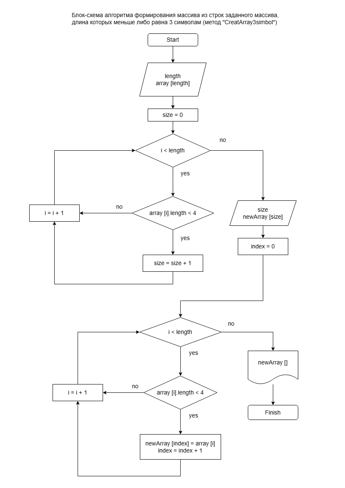

# Задача

Написать программу, которая из имеющегося массива строк формирует новый массив из строк, длина которых меньше, либо равна 3 символам. Первоначальный массив можно ввести с клавиатуры, либо задать на старте выполнения алгоритма. При решении не рекомендуется пользоваться коллекциями, лучше обойтись исключительно массивами.

# Решение

## Описание методов программы

Программа состоит из 3-х методов:

|Номер|Название метода                          |Описание метода                |
|-----|--------------------------------|-------------------------|
|1    | ***CreatInputArray*** |метод ввода пользователем заданного массива с помощью консоли|
|2    | ***ShowArray*** |метод вывод массива в консоль|
|3    | ***CreatArray3simbol*** |метод формирования массива из строк заданного массива, длина которых меньше либо равна 3 символам|

## Реализация методов программы

1. Метод ***CreatInputArray***

Данный метод создает исходный массив с помощью цикла. Размер и элементы данного массива вводятся пользователем посредством консоли.

Метод на вход принимает размер массива. Затем посредством цикла происходит заполнение элементов массива значениями.

Метод возвращает массив, заданный пользователем.

2. Метод ***ShowArray***

В данном методе реализован вывод массива в консоль посредством цикла.

Метод на вход принимает массив. Затем посредством цикла происходит вывод в консоль значения элементов массива.

3. Метод ***CreatArray3simbol***

Метод на вход принимает массив.

Сначала запускается цикл, который в принимаемом массиве проверяет все элементы на условие задачи: длина строк меньше либо равна 3 символам. Если условие выполняется, то в переменную size прибавлятся 1. Таким образом, после отработки цикла в переменной size будет число, обозначающее количество элементов, соответсвующих условию задачи.

Далее объявляется пустой массив с размером size.

Далее с помощью цикла происходит заполнения созданного массива элементами из исходного массива, соответствущими условию.

Метод возвращает массив, соответствующий условию задачи.

>Блок-схема алгоритма представлена на рисунке ниже.

## Реализация программы

1. Запускается команда запроса у пользователя размера массива посредством консоли.

> ***Внимание:*** При вводе размера массива в консоль не рекомендуется указывать слишком большое число, так как ввод каждого элемента массива займет продолжительное время.

2. После ввода пользователем размера массива запускается метод ***CreatInputArray***. Пользователь вводит значения каждого элемента массива в консоли, происходит заполнение массива значениями.
3. После ввода пользователем значений элементов массива запускается метод ***ShowArray***. В консоль выводится созданный пользователем массив.
4. Дале запускается метод ***CreatArray3simbol***, который из введенного массива возвращает новый массив, соотвествующий условиям задачи.
5. Полученный массив выводится в консоль с помощью метода ***ShowArray***.

## Дополнительные проверки

В программе реализована проверка ввода пользователем размера массива. Пользователю допускается вводить только числа больше 0, так как размер массива не можеть быть меньше или равен 0 или какому-либо другому нецифровому символу.